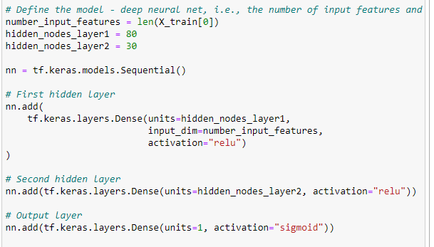
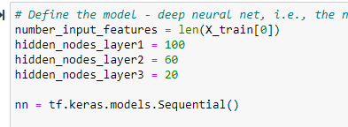

# Neural Network Charity Analysis
We have been tasked with creating a binary classifier that is capable of predicting whether applicants will be successful if funded by Alphabet Soup. We have received a data set from Alphabet Soup's business team with more than 34,000 organizations that have received funding from Alphabet Soup over the years. We are striving to determine which grant applications are most likely to be successful
sful with their grants in doing good. 

## Results

> ### Data Preprocessing
We started by removing the columns EIN and Name that contain identification information from the input data. After that we identified that IS_SUCCESSFUL was the target for the neural network as it contained the binary data necessary on whether or not the charity donations were effective.The variables that are considered key features for the model are: Application Type, Affiliation Classification, Use Case, Income Amount, Special Consideration, Ask Amount.As for the "EIN" and "NAME" variables; they are unnecessary and can be removed. 

### Compiling, Training, and Evaluating the Model

> For my model I selected 2 layers, 80 and 30 neurons respectively

    

> I was unable to achieve the 75% target accuracy. 73% was the best I achieved. 

   

> In attempt to increase the performance of the model I increased the neurons and layers -> 3 layers total, 100, 60, 20 neurons respectively
   
   

> I also removed noise data outliers: the top 10% of AMT_REQUESTED (some amounts were in excess of $1 Billion)
> I also removed columns that may not contain useful information: "APPLICATION TYPE" & "CLASSIFICATION" [rather than bucket some to OTHER]

## Summary
Neural Networks are challenging. There are many adjustable parameters that are up to the analyst. With so many levers to pull it can be very difficult to determine an optimal outcome or to achieve the goal accuracy.  We were unsuccessful in reaching the target of 75%, in fact the highest accuracy I was able to provide was 73%. We can assume that the model is not outperforming based on these results. This being a binary classification we might suggest using a supervised machine learning model to better classify output and evaluate that data against the neural network outcome. Further analysis could look at the sensitivity of the individual parameters to determine if some should be removed or prioritized. 